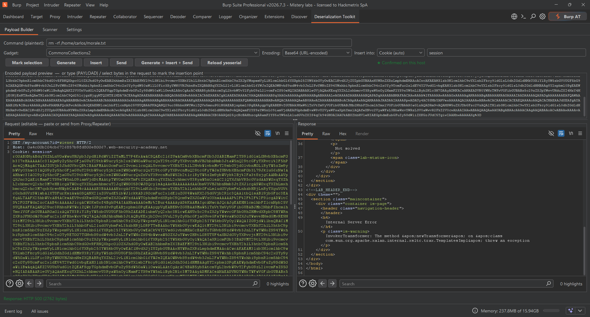
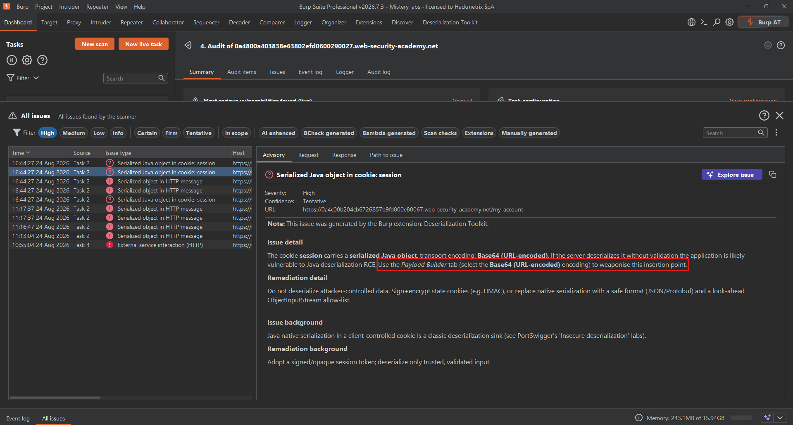
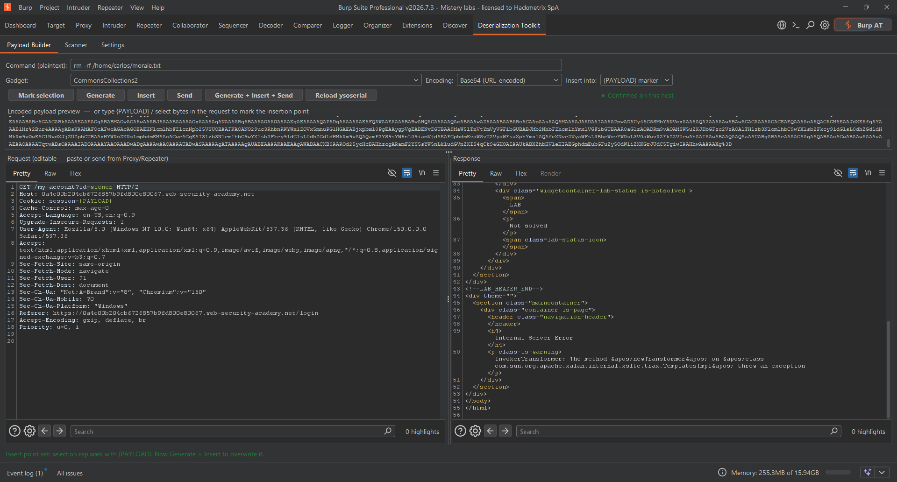
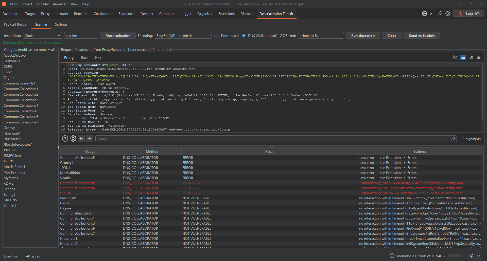
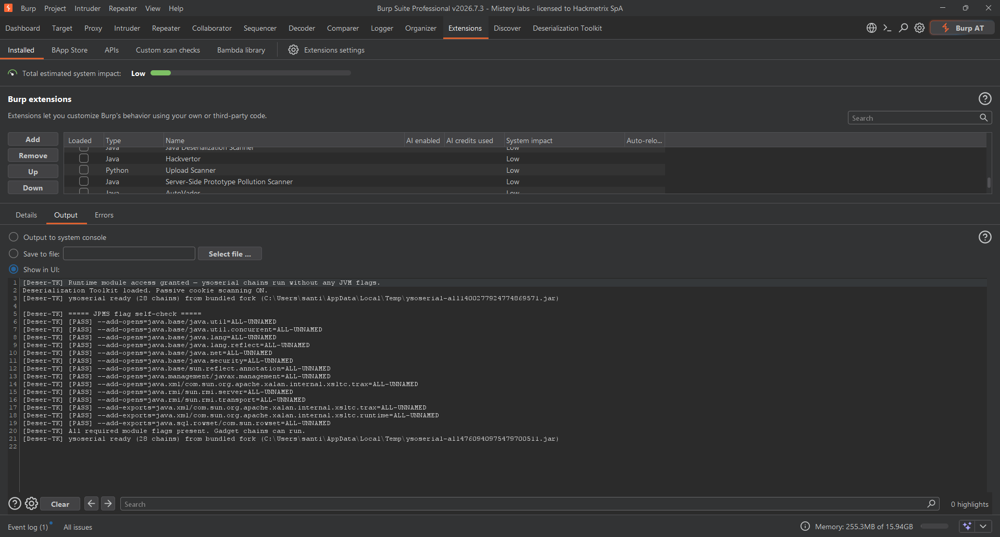
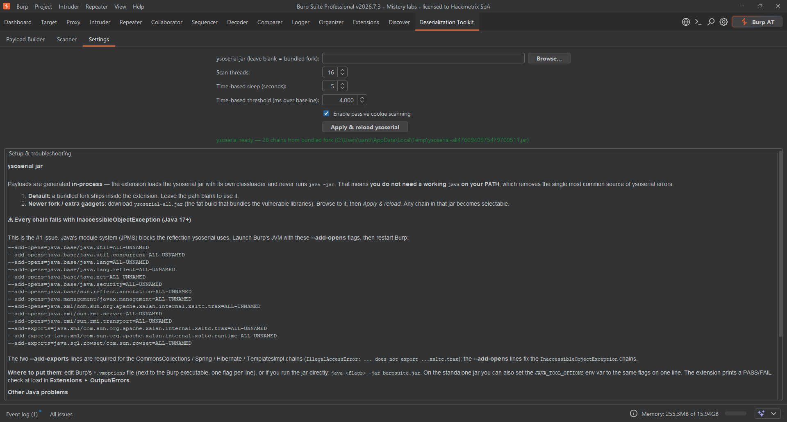

<div align="center">

# 🧬 Deserialization Toolkit

### Next-generation Java deserialization detection & exploitation for Burp Suite

A modern, faster rewrite of Federico Dotta's classic
[Java Deserialization Scanner](https://github.com/federicodotta/java-deserialization-scanner) —
rebuilt on the **Montoya API**, with a text-to-cookie **Payload Builder**, a **gadget recommender**,
and **passive detection of insecure cookies**.

<!-- Screenshot: "Deserialization Toolkit" tab on the Payload Builder — command + gadget + green response. ~1200-1600px wide. -->


<sub><em>From a plaintext command to a ready-to-send ysoserial cookie — and the target's response — in one tab.</em></sub>

[](https://portswigger.net/burp/documentation/desktop/extensions)
[](https://adoptium.net/)
[](pom.xml)
[](https://github.com/frohoff/ysoserial)
[](LICENSE)
[](#-contributing)

</div>

---

## 📑 Table of Contents

- [Why this rewrite?](#-why-this-rewrite)
- [Features](#-features)
- [Screenshots / Workflow](#-workflow)
- [Architecture](#-architecture)
- [Supported gadget chains](#-supported-gadget-chains)
- [Requirements](#-requirements)
- [Build](#-build)
- [Install in Burp](#-install-in-burp)
- [Usage](#-usage)
  - [1. Passive: find insecure & serialized cookies](#1-passive-find-insecure--serialized-cookies)
  - [2. Payload Builder: plaintext command → cookie → send](#2-payload-builder-plaintext-command--cookie--send)
  - [3. Scanner: confirm the vulnerability](#3-scanner-confirm-the-vulnerability)
- [Java runtime & troubleshooting](#-java-runtime--troubleshooting)
- [Performance notes](#-performance-notes)
- [Configuration reference](#-configuration-reference)
- [Security & legal](#-security--legal)
- [Credits](#-credits)
- [License](#-license)

---

## 🚀 Why this rewrite?

The original extension is excellent but shows its age: it targets the **legacy** Burp API, runs
detection sequentially, and expects you to paste raw serialized bytes by hand. The Toolkit keeps the
proven detection ideas and modernises everything around them.

| | Original | **Toolkit** |
|---|---|---|
| Burp API | Legacy `IBurpExtender` | **Montoya** (native editors, real threading, project persistence) |
| Payload flow | Paste raw bytes manually | **Plaintext command → gadget → encoding → cookie → send → response**, one screen |
| Gadget choice | Manual, blind | **Recommender** ranks chains by what passive/active scans already learned per host |
| ysoserial | Fixed embedded fork | Bundled fork **+** hot-swappable external `ysoserial-all.jar`, loaded **in-process** |
| Insecure cookies | — | **Passive scan**: serialized-blob cookies + missing `Secure`/`HttpOnly`/`SameSite` |
| Speed | Sequential probes, new JVM per payload | **Thread pool**, payload cache, O(1) magic-byte detection, zero `java` subprocess |
| Libraries | ~13 | **Full modern set** (Beanutils, C3P0, Vaadin, Rhino, ROME, Click, Clojure, Hibernate, …) |

---

## ✨ Features

- **In-process ysoserial engine** — payloads are generated by loading the ysoserial jar with a
  private `URLClassLoader` and calling its payload classes by reflection. **No `java` on your PATH,
  no subprocess, no JVM cold-start.** This eliminates the single most common ysoserial failure mode.
- **Zero JVM-flag setup** — the extension opens the JDK-internal packages ysoserial needs **at load
  time**, so gadget chains work on a **stock Burp with no `--add-opens`/`vmoptions` edits** (the pain
  point of every ysoserial-based tool on Java 17+).
- **Payload Builder** — type a command like `rm -rf /home/carlos/test.txt`, pick a *Common* (gadget),
  pick an encoding, and the extension builds the payload, injects it, sends the request and shows the
  response — **without leaving the tab**.
- **Flexible insertion points** — the payload can go anywhere in the request, not just a cookie:
  **Selection / caret** (select the bytes to replace, or drop it at the caret), **`{PAYLOAD}` marker**
  (type the marker where you want it), or **Cookie (auto)**. Insertion is line-break-safe: a payload
  containing CR/LF/NUL is refused before it can corrupt a header or truncate the request, and
  `Content-Length` is recomputed automatically after a body insertion.
- **Gadget recommender** — a per-host intelligence store (`HostIntel`) fed by passive findings,
  fingerprints and confirmed hits ranks chains so the most likely one is pre-selected.
- **Passive insecure-cookie scanner** — flags:
  - 🔴 **Serialized Java objects in cookies** (any encoding — raw, Base64, hex, gzip) as *High*, and
    the finding **names the detected transport encoding** (e.g. "Base64 (URL-encoded)") so you can
    reproduce it directly in the Payload Builder.
  - 🟠 **Weak cookie flags** (missing `Secure` / `HttpOnly` / `SameSite`) on stateful cookies.
- **Active detection** — **time-based** (sleep) and **DNS via Burp Collaborator** (URLDNS),
  run concurrently across selected chains. The Scanner supports the same insertion points as the
  builder (**cookie** or **`{PAYLOAD}` marker**), highlights **vulnerable rows in red**, and
  **sends a confirmed chain to the Payload Builder as a ready-to-fire exploit** in one click
  (button, double-click, or right-click). Chain errors are collapsed to a one-liner in the table
  (full cause stays in *Extensions ▸ Errors*).
- **Multiple encodings** — Raw, Base64, Base64 (URL), ASCII-Hex, GZIP, Base64+GZIP, Base64+GZIP (URL).
- **Context-menu integration** — right-click any request in Proxy/Repeater → *Send to Payload Builder*
  or *Send to Scanner*.
- **Persistent settings** — jar path, threads, thresholds and passive toggle survive restarts.

---

## 🖥 Workflow

```
        ┌─────────────────────────────────────────────────────────────────────┐
        │  PASSIVE SCAN                                                         │
        │  Burp proxies traffic ─▶ CookiePassiveScanCheck                       │
        │     • serialized-blob cookie  ─▶ HIGH issue + HostIntel.recordBlob    │
        │     • weak flags              ─▶ LOW issue                            │
        │     • framework fingerprints  ─▶ HostIntel.recordFingerprint         │
        └───────────────┬─────────────────────────────────────────────────────┘
                        │  right-click ▶ "Send to Payload Builder"
                        ▼
        ┌─────────────────────────────────────────────────────────────────────┐
        │  PAYLOAD BUILDER                                                      │
        │  command: rm -rf /home/carlos/test.txt                               │
        │  gadget:  [CommonsCollections6 ★ recommended]   encoding: [Base64]    │
        │  ─▶ Generate + Insert into cookie + Send  ─▶ view Response            │
        └───────────────┬─────────────────────────────────────────────────────┘
                        │  confirm blind cases
                        ▼
        ┌─────────────────────────────────────────────────────────────────────┐
        │  SCANNER   time-based (sleep N)  |  DNS (Collaborator / URLDNS)       │
        │  concurrent probes ─▶ results table ─▶ confirmed chains feed recommender
        └─────────────────────────────────────────────────────────────────────┘
```

<!-- Screenshot: full Payload Builder — command `rm -rf /home/carlos/...` → gadget CommonsCollections6 ★ recommended → encoding Base64 → Response 200 on the right. -->
<p align="center"><br><sub><em>Payload Builder: type a command, keep the recommended gadget, generate + insert + send, read the response.</em></sub></p>

---

## 🏗 Architecture

```
src/main/java/burp/
├── JavaDeserializationScannerNG.java   # BurpExtension entry + context menu
├── core/
│   ├── YsoserialEngine.java            # in-process URLClassLoader payload generator (+cache)
│   ├── GadgetCatalog.java              # gadget metadata: required lib + fingerprints
│   ├── Encoder.java                    # Raw/Base64/Hex/GZIP/URL encodings
│   ├── SerializationDetector.java      # O(1) magic-byte classification (rO0/aced/H4sI/…)
│   ├── Settings.java                   # persisted preferences
│   └── ExecutorProvider.java           # shared bounded thread pool
├── model/
│   ├── Gadget.java  DetectionResult.java
│   └── HostIntel.java                  # per-host memory powering the recommender
├── scan/
│   ├── CookiePassiveScanCheck.java     # Montoya ScanCheck (passive)
│   └── DeserializationScanEngine.java  # time-based + Collaborator DNS detection
└── ui/
    ├── MainTab.java  PayloadBuilderPanel.java  ScannerPanel.java  SettingsPanel.java
    └── CookieRewriter.java             # safe Cookie-header rewriting
```

**Design principles:** never shell out; never deserialize untrusted data locally; do all
classification in constant time; keep the UI on the EDT and all I/O on worker threads.

---

## 🧩 Supported gadget chains

Chains available at runtime are read directly from your `ysoserial-all.jar`, so the list grows
automatically with a newer fork. The catalogue enriches these with the required library and
fingerprint hints used by the recommender:

`URLDNS` · `JRMPClient` · `CommonsCollections1–7` · `CommonsBeanutils1` · `BeanShell1` · `Groovy1`
· `Spring1/2` · `Hibernate1/2` · `ROME` · `JSON1` · `MozillaRhino1/2` · `C3P0` · `Click1` · `Vaadin1`
· `Clojure` · `JBossInterceptors1` · `Myfaces1` · `AspectJWeaver` · `Jdk7u21` · `Jdk8u20`

> New chain in a fork? Add one row to `GadgetCatalog` to make it *recommendable*; it is already
> *usable* the moment it exists in the jar.

---

## 📋 Requirements

- **Burp Suite** (Community or Professional) 2023.x+ with the **Montoya API**.
  *DNS/Collaborator detection needs Professional.*
- **JDK 17+** to build (Burp itself ships a compatible JRE).
- **Maven 3.8+**.
- A **`ysoserial-all.jar`** (fat build) — bundled at build time or supplied at runtime.

---

## 🔧 Build

```bash
# 1) (optional) bundle a ysoserial fat jar so it ships inside the extension
cp /path/to/ysoserial-all.jar src/main/resources/ysoserial/ysoserial-all.jar

# 2) build the extension
mvn clean package

# 3) artifact:
#    target/deserialization-toolkit.jar
```

If you skip step 1, the extension builds fine and you point it at an external
`ysoserial-all.jar` from the **Settings** tab at runtime.

---

## 🧩 Install in Burp

1. **Extensions ▸ Installed ▸ Add**
2. Extension type: **Java**
3. Select `target/deserialization-toolkit.jar`
4. A new top-level tab **“Deserialization Toolkit”** appears.

---

## 📖 Usage

### 1. Passive: find insecure & serialized cookies

Just browse the target through Burp. Findings appear under **Target ▸ Issues / Dashboard**:

- **“Serialized Java object in cookie: `<name>`”** — *High*. Your direct lead. Right-click the
  request → **Send to Payload Builder**.
- **“Insecure cookie flags: `<name>`”** — *Low*. Missing `Secure`/`HttpOnly`/`SameSite`.

<!-- Screenshot: Dashboard/Issues showing the HIGH "Serialized Java object in cookie" issue, detail panel naming the detected transport encoding. -->
<p align="center"><br><sub><em>Passive scan raises a High issue for a serialized Java object in a cookie and names the transport encoding.</em></sub></p>

### 2. Payload Builder: plaintext command → cookie → send

Reproducing a PortSwigger *Insecure deserialization* lab:

1. **Command:** `rm -rf /home/carlos/morale.txt`
2. **Gadget:** the top ★ entry (recommender picks it from passive fingerprints — usually
   `CommonsCollections6` for the labs).
3. **Encoding:** `Base64 (URL-encoded)` for a cookie.
4. **Insert into:** `Cookie (auto)` for the labs, or `Selection / caret` / `{PAYLOAD} marker` to place
   the payload in a header, body or query parameter instead.
5. Click **Generate + Insert + Send**. Read the **Response** on the right.

The encoded payload is shown in the preview box, and the request editor is fully editable if you
want to tweak anything before sending.

<!-- Screenshot: request editor with bytes highlighted via "mark selection" / a {PAYLOAD} marker, showing flexible insertion points beyond the cookie. -->
<p align="center"><br><sub><em>Beyond cookies: mark a selection or drop a <code>{PAYLOAD}</code> marker to inject into any header, body or parameter.</em></sub></p>

### 3. Scanner: confirm the vulnerability

For blind cases, open the **Scanner** sub-tab:

- **Time-based** — select one/many chains; each injects `sleep N` and is flagged when the response
  is slower than *baseline + threshold*.
- **DNS (Collaborator)** — injects `URLDNS` at a fresh Collaborator subdomain; a DNS interaction
  proves deserialization even with no command output. *(Burp Pro)*

Confirmed chains are remembered per host and bubble to the top of the recommender everywhere.

<!-- Screenshot: Scanner results table with a red VULNERABLE row (time-based sleep confirmed) and the one-click "send to exploit" hand-off. -->
<p align="center"><br><sub><em>Scanner confirms every vulnerable chain (red rows) and hands any of them to the Payload Builder in one click.</em></sub></p>

---

## 🛠 Java runtime & troubleshooting

Payloads are generated **in-process** — the extension **never runs `java -jar`**, so a broken,
missing or duplicated JDK on your machine is irrelevant.

### JPMS module access — handled automatically (no JVM flags needed)

On modern JVMs (Java 17+) the module system blocks the reflection ysoserial performs on JDK
internals, which historically forced users to add a dozen `--add-opens`/`--add-exports` flags to
Burp's `vmoptions`. **This extension opens those packages itself at load time** (via the JDK's
trusted lookup — the same technique ByteBuddy/Lombok use), so it works on a **stock Burp with zero
configuration**. You'll see `Runtime module access granted` in **Extensions ▸ Output**.

<!-- Screenshot: Extensions ▸ Output showing the "[Deser-TK] Runtime module access granted" line — visual proof of the zero-flag setup. -->
<p align="center"><br><sub><em>Zero-flag setup: the extension opens the JDK-internal packages itself at load time — no <code>vmoptions</code> edits.</em></sub></p>

<details>
<summary><b>Fallback:</b> if a future JDK ever blocks the runtime opener, add these flags manually and restart Burp</summary>


```
--add-opens=java.base/java.util=ALL-UNNAMED
--add-opens=java.base/java.util.concurrent=ALL-UNNAMED
--add-opens=java.base/java.lang=ALL-UNNAMED
--add-opens=java.base/java.lang.reflect=ALL-UNNAMED
--add-opens=java.base/java.net=ALL-UNNAMED
--add-opens=java.base/java.security=ALL-UNNAMED
--add-opens=java.base/sun.reflect.annotation=ALL-UNNAMED
--add-opens=java.management/javax.management=ALL-UNNAMED
--add-opens=java.xml/com.sun.org.apache.xalan.internal.xsltc.trax=ALL-UNNAMED
--add-opens=java.rmi/sun.rmi.server=ALL-UNNAMED
--add-opens=java.rmi/sun.rmi.transport=ALL-UNNAMED
--add-exports=java.xml/com.sun.org.apache.xalan.internal.xsltc.trax=ALL-UNNAMED
--add-exports=java.xml/com.sun.org.apache.xalan.internal.xsltc.runtime=ALL-UNNAMED
--add-exports=java.sql.rowset/com.sun.rowset=ALL-UNNAMED
```

> The **`--add-exports`** lines matter and are separate from opens: TemplatesImpl chains
> (CommonsCollections/Spring/Hibernate/…) need `xsltc.trax` **and** `xsltc.runtime` *exported*,
> and Hibernate2 needs `com.sun.rowset`. Missing exactly one line breaks a subset of chains.
>
> The extension runs a **per-line PASS/FAIL self-check** at load against the real ysoserial
> classloader and prints it to **Extensions ▸ Output/Errors** — a `[FAIL]` line is the exact flag to add.
>
> **Irreducible (not a flag problem):** `Groovy1` (`GroovyBugError`) and `Clojure` (clash with the
> Hackvertor extension) fail on modern JDKs inside ysoserial itself; no flag fixes them, and they are
> not needed for the PortSwigger labs.

**Where to put them:**

| How you run Burp | Where |
|---|---|
| Installer build | Edit `BurpSuiteCommunity.vmoptions` / `BurpSuitePro.vmoptions` next to the executable — **one flag per line** |
| Standalone jar | `java <flags> -jar burpsuite.jar` |
| Either | Set env var `JAVA_TOOL_OPTIONS="<flags on one line>"` before launching |

</details>

### Other classpath issues

Field guide (also embedded in the **Settings** tab):

| Symptom | Cause | Fix |
|---|---|---|
| `No ysoserial jar found` | No bundled jar and no path set | Bundle `ysoserial-all.jar` or set a path in **Settings** |
| `NoClassDefFoundError` on a gadget lib | Pointed at the **slim** `ysoserial.jar` | Use the **fat** `ysoserial-all.jar` |
| `UnsupportedClassVersionError` | External jar built for a newer JDK than Burp's JRE | Use the bundled fork or a Java-17 build |
| Reflective-access / module warnings | JPMS restrictions for a chain | Start Burp with `--add-opens java.base/java.util=ALL-UNNAMED` |
| `Jar loaded but no payload classes found` | Wrong/empty jar | Verify it contains `ysoserial/payloads/*.class` |

Build a fat jar from source:

```bash
git clone https://github.com/frohoff/ysoserial
cd ysoserial
mvn clean package -DskipTests        # -> target/ysoserial-all.jar
```

Then either copy it into `src/main/resources/ysoserial/` before building the extension, or select
it at runtime via **Settings ▸ ysoserial jar ▸ Browse…**.

---

## ⚡ Performance notes

- **In-process generation + cache** — the ysoserial classloader and generated payloads are cached;
  regenerating the same `(gadget, command)` is a map hit, not a fresh serialization.
- **Bounded thread pool** — active probes run concurrently (default = CPU count, clamped 1–32),
  sized from **Settings** and rebuilt only when changed.
- **O(1) passive classification** — cookies are classified by transport-form magic bytes
  (`rO0…`, `aced…`, `H4sI…`) with no deserialization attempt, so passive scanning is essentially free.
- **Off-EDT I/O** — every network call runs on a worker/`SwingWorker`; the UI never blocks.
- **Lazy init** — ysoserial loads on a background thread at startup so Burp launch is never delayed.

---

## ⚙️ Configuration reference

| Setting | Default | Meaning |
|---|---|---|
| **ysoserial jar** | *(blank → bundled)* | Path to an external `ysoserial-all.jar` |
| **Scan threads** | CPU count (1–32) | Concurrency of active probes |
| **Time-based sleep** | 5 s | Sleep injected by time-based payloads |
| **Time-based threshold** | 4000 ms | Extra delay over baseline that flags a hit |
| **Passive cookie scanning** | On | Toggle the passive `ScanCheck` |

All values persist in Burp's project/user preferences.

<!-- Screenshot: Settings tab — external ysoserial path, scan threads, sleep/threshold, passive toggle. -->
<p align="center"><br><sub><em>Settings: point at an external ysoserial jar, tune scan concurrency and time-based thresholds, toggle passive scanning.</em></sub></p>

---

## 🔒 Security & legal

This tool generates **real remote-code-execution payloads**. Use it **only** against systems you own
or are **explicitly authorised** to test (e.g. PortSwigger Academy labs, your own staging). Running
deserialization payloads against third-party systems without permission is illegal in most
jurisdictions. The authors accept no liability for misuse.

The extension itself never deserializes untrusted data locally; it only *generates* and *sends*
payloads, and classifies inbound data by magic bytes.

---

## 🙌 Credits

- **Federico Dotta** — original [Java Deserialization Scanner](https://github.com/federicodotta/java-deserialization-scanner).
- **Chris Frohoff & contributors** — [ysoserial](https://github.com/frohoff/ysoserial).
- **PortSwigger** — Burp Suite & the Montoya API.

---

## 📄 License

Released under the **MIT License** — see [LICENSE](LICENSE). Derivative of the MIT-licensed original
by Federico Dotta.

---

## 🤝 Contributing

PRs welcome. Good first contributions: add a `GadgetCatalog` row for a new chain, add an encoding,
or wire a Windows-aware time-based command. Please keep the “never shell out / never deserialize
untrusted input” invariants intact.
